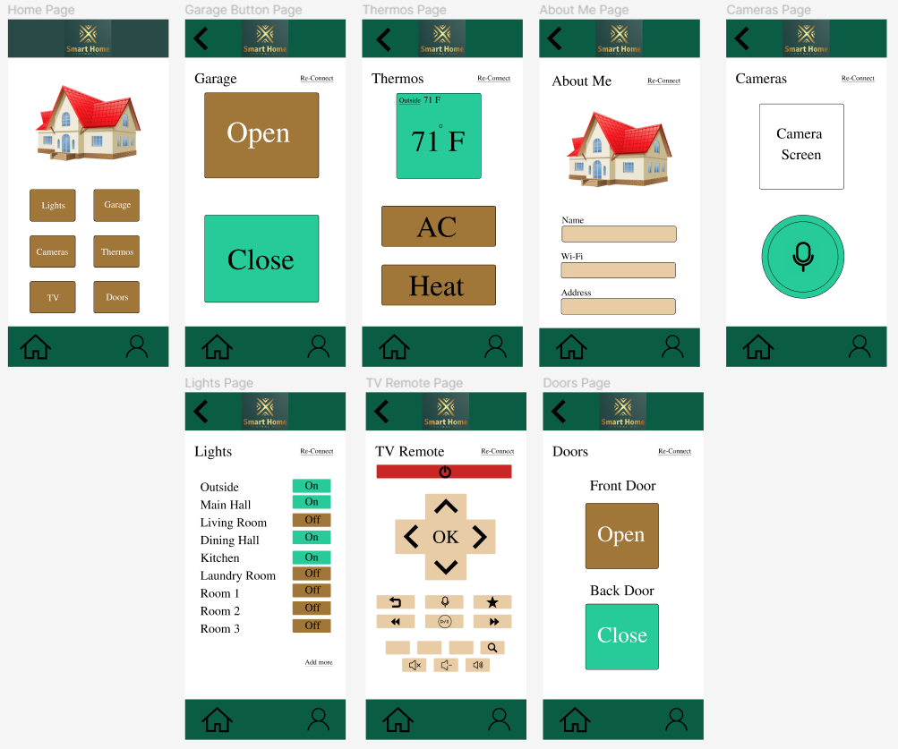

# Smart_Home_Central_Hub

A group project for SWDV 650 at Maryville University

# How to run:

```bash
git clone https://github.com/Saints-Squad-2/Smart_Home_Central_Hub.git

cd ./Smart_Home_Central_Hub

npm install

npm start || node app.js
```

# Wireframe prototype

[Link to Figma wireframe prototype](https://www.figma.com/file/JViZUwHEz0nqW3cCbUAXdn/Smart-Home-Central-Hub?type=design&node-id=0%3A1&mode=design&t=SObQSBXDw96apqGs-1)



# Testing

Testing is implemented with the [Mocha](https://mochajs.org/) framework

Tests can be found in the *tests* folder

### How to run tests: 

```bash
npm test
```

# Database connection

Database support is set up using [Objection.js](https://vincit.github.io/objection.js/), an ORM built on top of [Knex.js](https://knexjs.org/)

The *database* folder contains Base (a base orm class), a .txt file with related commands, and a 
*knex* folder

The *knex* folder contains migrations, seeds, and files for obtaining a Knex instances, one based on the configuration in knexfile.js and the other a test instance that utilizes an in-memory sqlite database.

*knex/migrations* contains schema definitions for our application.

### Example of using the database connection

```javascript
const knex = require('./database/knex/knex');
const Base = require('./database/base');

// Base must be set up to use a Knex instance
Base.knex(knex);
```

# Server

This project contains an API server written using [express.js](http://expressjs.com/). This API can be used to get data from and change data in a SmartHomeApp instance.

The code for this server can be found in *app.js*

### How to run

```bash
npm start
```

OR

```bash
node app.js
```

### Endpoints

GET '/': Text response confirming the operation of the server

GET '/speechToText': *speech-to-text.html* file

GET '/app': JSON response showing SmartHomeApp instance

GET '/app/reload': Reloads the SmartHomeApp instance from the database.

GET '/app/add/:type': Adds a SmartAppliance object to the SmartHomeApp instance. SmartAppliance type is based on the *:type* parameter. Currently supported types are 'camera', 'thermometer', and 'light'. 

GET '/app/remove/:id': Removes the SmartAppliance instance with id *:id* from the SmartHomeApp instance.

GET '/app/removeAll': Removes all SmartAppliance instances from the SmartHomeApp instance.

GET '/app/:id/:func': Executes method *func* on the SmartAppliance instance with id *id*. E.g. '/app/2/powerOn' is equivalent to smartAppliance2.powerOn(). This can be used to execute methods that don't require any arguments.

GET '/app/:id': JSON response showing SmartAppliance instance with id *id*

POST '/app/:id/addNotification': Adds a Notification instance to the SmartAppliance instance with id *:id*. The query parameter is *info* (the notification message). E.g. '/app/1/addNotification?info=This is a test notification!'.

POST '/app/:id': Query parameters are *instanceVar* (instance variable to set) and *val* (value to use). Sets the *instanceVar* of the SmartAppliance instance with id *:id* to *val*. E.g. '/app/2?instanceVar=preferredTemp&val=70'.

DELETE '/app/:id/notifications/:notifId': Deletes the Notification instance with id *:notifId* from the SmartAppliance instance with id *id*.

# Classes

Classes can be found in the *classes* folder, except where otherwise noted

### Base (Base ORM Class)

ORM Base class for saving instances to / loading instances from a database.

Extends [Model](https://vincit.github.io/objection.js/api/model/) class from objection.js.

\*Found in the *database* folder

#### Properties

id: Database id for instance

*static tableName: Must be set up to return the name of the table

*static relationMappings: Used to set up database relationships (see [here](https://vincit.github.io/objection.js/guide/relations.html#examples))

#### Methods

*cls refers to the class of the instance. This is necessary for child classes to correctly save / load.*

constructor()
 
async insert(cls): Inserts instance into database 

async update(cls): Updates instance in database

async save(cls): Dynamically inserts or updates instance based on whether it exists in the database

async deleteFromDB(cls): Deletes instance from the database

static async loadById(cls, id: Number): Loads and returns instance from the database based on the instance's id

#### Examples: 

```javascript
const Base = require('./database/base');

class Example extends Base {
    static get tableName() {
        return 'examples';
    }

    ...
}

const example = new Example();
await example.save(Example);
```

### SmartHomeApp

Smart Home Application class for holding information about available SmartAppliance instances.

Extends Base ORM class.

#### Properties

available: array of associated SmartAppliance instances

#### Methods

constructor()

addAppliance(apl: SmartAppliance):

removeAppliance(apl: SmartAppliance):

numberOfAppliances(): Returns the number of SmartAppliance instances in available array

getApplianceById(id: Number): Returns a SmartAppliance instance from available based on id, or null if no instance exists

async saveAvailable(): Saves the state of each SmartAppliance instance in available

async loadAvailable(): Loads available SmartAppliance instances from the database

async fullSave(): Fully saves the instance and SmartAppliance instances in available

static async fullLoadById(id: Number): Loads and returns an instance from the database based on its id

static async loadOrNew(id: Number): Returns an instance loaded from the database by id, or a new instance if no instance exists

#### Examples: 

```javascript
const SmartHomeApp = require('./classes/homeApp');

const smartHomeApp = new SmartHomeApp();
```

## Smart Appliance Classes

### SmartAppliance

Base class that holds a notifications array, name, power status, and connected status.

Extends Base ORM class.

#### Properties

connected: Whether the device is connected or not

poweredOn: Whether the device is powered on or not
 
name: A custom name for the appliance

notifications: A NotificationArray for adding/removing Notification instances

smartHomeAppId: Database id for associated SmartHomeApp instance

#### Methods

constructor(notifications: NotificationArray, name='': String)

connect(): Set connected to true

disconnect(): Set connected to false

powerOn(): Set poweredOn to true

powerOff(): Set poweredOn to false

setIds(): Set ids for proper database saving

async saveNotificationArray(): Save notifications to the database

async loadNotificationArray(): Load notification from the database

async fullSave(): Fully save the instance and associated notifications to the database

static async fullLoadById(id: Number): Fully load an instance based on its id in the database

#### Examples: 

```javascript
const { NotificationArray } = require('./classes/notifications');
const { SmartAppliance } = require('./classes/appliance');

const notifications = new NotificationArray();
const appliance = new SmartAppliance(notifications);
```

```javascript
const { SmartAppliance } = require('./classes/appliance');

class childAppliance extends SmartAppliance {
    ...
}
```

#### Other

*appliance.js* also exports:

function restoreAppliance(appliance: SmartAppliance): Returns a SmartAppliance instance restored to its proper child class. This also restores boolean values. Designed to be used with SmartAppliance instances loaded from the database.

### Thermostat

Thermostat class that holds preferred, minimum, and maximum temperatures, as well as units (C or F).

Extends SmartAppliance

#### Properties

units: Celsius or Fahrenheit 

preferredTemp: A preferred temperature

minTemp: A minimum temperature

maxTemp: A maximum temperature

validTemps: Whether the temperature configuration is valid or not

#### Methods

constructor(notifications: NotificationArray, name='': String, units='F: 'C' OR 'F')

resetPreferredTemp(): Set preferredTemp to null

resetMinTemp(): Set minTemp to null

resetMaxTemp(): Set maxTemp to null

resetTemps(): Set all temperature variables to null

#### Examples: 

```javascript
const { NotificationArray } = require('./classes/notifications');
const { Thermostat } = require('./classes/thermostat');

const notifications = new NotificationArray();
const thermostat = new Thermostat(notifications);
```

### Camera

The camera class is a component of the Smart Home Hub system, extending the smart appliance class. It is designed to control and manage home cameras, offering features such as recording, saving, and playing back video recordings.

#### Class Overview

The camera class represents a smart camera device within the Smart Home Hub system. It inherits properties and methods from the base smart appliance class and adds functionality specific to cameras.

#### Class Constructor

constructor(name = '', resolution = '1080p') 

**name (string, optional)**: The name of the camera.

**resolution (string, optional)**: The initial resolution setting of the camera (e.g., '1080p' '720p'). The default is '1080p'.

#### Properties

**resolution (string)**: Represents the current resolution setting of the camera. It can be set to various resolution values to control the video quality.

**_isRecording (boolean)**: Indicates whether the camera is currently recording.

**_recordings (array)**: An array to store recorded video segments.

#### Methods

**startRecording()**: Initiates the recording process. If the camera is not already recording, it starts recording and logs a message.

**stopRecording()**: Stops the recording process. If the camera is currently recording, it stops the recording and logs a message.

**saveRecording(recording)**: Saves a recorded video segment. If the camera is recording, it adds the segment to the _recordings array and logs a message.

**playbackRecording(index)**: Initiates the playback of a recorded video segment. If the provided index is valid (within the range of recorded segments), it logs a message indicating the playback of the corresponding recording.

#### Usage

The camera class is designed to be a flexible and extensible component for managing smart cameras within your smart home system. You can control the camera's resolution, initiate recording, and stop recording, save recorded segments, and play back recordings.

### Light Class

The light class is a part of the Smart Home Hub system and extends the smart appliance class. It is designed to control home lighting and provides additional features, such as voice control and motion detection.

#### Class Overview

The light class represents a smart light device that can be controlled through code or external inputs like voice commands and motion detection. It inherits properties and methods from the base smart appliance class and adds specific functionality for lights.

#### Class Constructor

constructor(name = '', brightness = 100) 

**name (string, optional)**: The name of the light.

**brightness (number, optional)**: The initial brightness level of the light (0 to 100, default is 100).

#### Properties

**brightness (number)**: Represents the brightness level of the light, ranging from 0 (off) to 100 (maximum brightness).

**_voiceControlEnabled (boolean)**: Indicates whether voice control is enabled for the light.

**_motionDetectionEnabled (boolean)**: Indicates whether motion detection is enabled for the light.

#### Methods

**turnOn()**: Turns the light on and logs a message.

**turnOff()**: Turns the light off and logs a message.

**enableVoiceControl()**: Enables voice control for the light and logs a message.

**disableVoiceControl()**: Disables voice control for the light and logs a message.

**enableMotionDetection()**: Enables motion detection for the light and logs a message.

**disableMotionDetection()**: Disables motion detection for the light and logs a message.

**respondToVoiceCommand(command)**: Receives a voice command and logs the command when voice control is enabled. If voice control is disabled, it logs a message indicating that voice control is not enabled.

**detectMotion()**: Detects motion and turns on the light when motion detection is enabled. It logs appropriate messages based on the detection status.

#### Usage

The light class can be used to create instances of smart lights and control them programmatically. You can change the brightness, turn lights on or off, enable/disable voice control, and enable/disable motion detection based on your requirements.

## Notification Classes

### Notification

Notification class that holds info and whether it is active or not.

Extends Base ORM class.

#### Properties

info: Information message for the notification

active: Whether the notification is active or not 

notArrId: Database id for associated NotificationArray

#### Methods

constructor(info: String, notArrId=null: Number)

makeActive(): set active to true

makeInactive(): set active to false

#### Examples: 

```javascript
const { Notification } = require('./classes/notifications');

const notification = new Notification('This is a test!');
```

### NotificationArray

Notification array class for holding Notification instances.

Extends Base ORM class.

#### Properties

data: Array of Notification instances

show: Whether notifications should be shown or not (hidden)

applianceId: Database id for associated SmartAppliance instance

#### Methods

constructor(data=[]: Array, applianceId=null: Number)

add(notif: Notification): Add notif to data array

remove(notif: Notification): Remove notif from data array

showNotifications(): Set show to true

hideNotifications(): Set show to false

getNotificationById(id: Number): Returns a Notification instance from data based on id, or null if no instance exists

async fullSave(): Save instance and all Notification instances in data array

async loadNotifications(): Load related Notification instances from database 

static async fullLoadById(id: Number): Load and return instance from database by instance's id

static async fullLoadByApplianceId(appId: Number): Load and return instance from database by id of related SmartAppliance instance  

#### Examples: 

```javascript
const { Notification, NotificationArray } = require('./classes/notifications');

const notification = new Notification('This is a test!');
const notifArray = new NotificationArray();

notifArray.add(notification);
```

## Other Classes

### Microphone Class

1.	Creating a system where a mobile device can talk to another smart device involves several components, including acquiring audio from the microphone, encoding the audio, transmitting the audio, and then decoding and playing the audio on the receiving device. Example using JavaScript and WebRTC for audio communication between two devices in the same web application.

```javascript
class Microphone {
    constructor() {
        this.stream = null;
        this.mediaConstraints = { audio: true };
    }

    async getAudioStream() {
        if (!this.stream) {
            this.stream = await navigator.mediaDevices.getUserMedia(this.mediaConstraints);
        }
        return this.stream;
    }

    stop() {
        if (this.stream) {
            this.stream.getTracks().forEach(track => track.stop());
            this.stream = null;
        }
    }
}
```

2.	Peer Connection: 

Using WebRTC's RTCPeerConnection for the communication:

```javascript
const pcConfig = {
    iceServers: [{ urls: 'stun:stun.l.google.com:19302' }]
};

const localMicrophone = new Microphone();
const peerConnection = new RTCPeerConnection(pcConfig);

// When an ICE candidate is generated by the RTCPeerConnection
peerConnection.onicecandidate = (event) => {
    if (event.candidate) {
        // Send this candidate to the other device (e.g., using a signaling server)
    }
};

// To start the call:
async function startCall() {
    const localStream = await localMicrophone.getAudioStream();
    localStream.getTracks().forEach(track => peerConnection.addTrack(track, localStream));

    const offer = await peerConnection.createOffer();
    await peerConnection.setLocalDescription(offer);

    // Send `offer` to the other device (e.g., using a signaling server)
}

// On receiving an answer (from the other device):
function handleAnswer(answer) {
    peerConnection.setRemoteDescription(new RTCSessionDescription(answer));
}

// On receiving an ICE candidate (from the other device):
function addIceCandidate(candidate) {
    peerConnection.addIceCandidate(new RTCIceCandidate(candidate));
}
```
Explanation:

3.	Signaling: This omits the signaling part, which is crucial for the devices to exchange SDP and ICE data. Signaling is often done using WebSocket or other messaging protocols.

4.	Receiving Device: The receiving device should create its own RTCPeerConnection, set the remote offer, generate an answer, and send that answer back. Also, when the RTCPeerConnection fires a track event, the received track should be attached to an audio element to be played.


